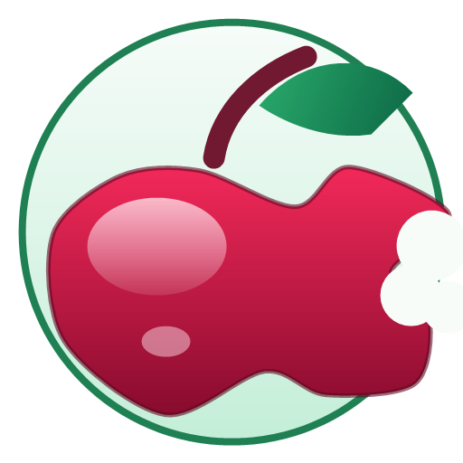

<h1 align="center">NEO Local LM</h1>

<p align="center">

</p>

NEO Local LM is a local-first chat app for Android, Windows, iOS, and Mac. Download GGUF models, load them in one tap, and chat privately with llama.cpp inference. If you choose an OpenRouter model, the app can switch cleanly between online and local mode.



## Features

- **Local GGUF inference** - no cloud needed for local models
- **Rich markdown** in chat responses - headers, code blocks, lists, and more
- **Reasoning model support** - thinking steps from compatible models are displayed in a styled section
- **Reliable background downloads** - custom download engine with OkHttp and WorkManager, progress notifications with speed and ETA, automatic resume on network interruptions
- **Storage management** - choose where to keep multi-GB model files with Android's Storage Access Framework
- **Desktop downloads** - Windows app downloads models to a selected folder or the default Downloads folder
- **OpenRouter support** - online-only Nemotron models are available when an API key is saved
- **Apple target** - the SwiftUI project builds for iPhone, iPad, and Mac desktop through Mac Catalyst
- **ARM optimized** - KleidiAI kernels and OpenMP for faster generation on arm64 devices
- **Large-screen ready** - tablets, foldables, and Chromebooks get a permanent sessions sidebar, list-detail Settings, and freeform window resize support

## Supported Models

| Family | Sizes | Provider |
|--------|-------|----------|
| Qwen 3 | 1.7B default | Alibaba |
| DeepSeek R1 Distill | 1.5B | DeepSeek |
| Gemma 3 | 1B | Google |
| Gemma2 | 9B | Google |
| Gemma 3n | 4B | Google |
| TinyLlama | 1.1B Q5 | TinyLlama |
| LFM2.5 Thinking | 1.2B | Liquid AI |
| Ministral 3 | 8B Instruct, 8B Reasoning | Mistral |
| Llama 3.2 | 3B Instruct Uncensored | Meta/Llama community GGUF |
| Qwen2.5.1-Coder | 7B Instruct | Alibaba/community GGUF |
| OLMo 2 1124 | 7B Instruct | Allen AI/community GGUF |

Models are GGUF-format, usually Q4_K_M, Q5_K_M, or Q6_K quantization, sourced from [Hugging Face](https://huggingface.co/).

## Online Option

Settings includes an OpenRouter API key field. When configured, the model picker shows **Nemotron 3 Nano (OpenRouter)** and **Nemotron 3 Super 120B Free (OpenRouter)** as online-only options. Selecting one bypasses local llama.cpp loading until you unload the online model or load a local GGUF model.

## Install

Download packages from the GitHub Releases page:

- **Windows**: use `Neo-Local-LLM-Windows-Portable.zip` or `Neo-Local-LLM-Windows-Standalone.exe`.
- **Android**: use `app-universal-release.apk` for most devices, `app-arm64-v8a-release.apk` for modern phones/tablets, or `app-x86_64-release.apk` for x86 emulators.
- **iOS and Mac**: Apple builds must be produced on macOS with Xcode and Apple signing. The Xcode project is included at `ios/NEOLocalLM/NEOLocalLM.xcodeproj`.

## Use The App

1. Open NEO Local LM.
2. Open the model picker.
3. Download a local GGUF model. Qwen 3 1.7B is the default local model.
4. Load the downloaded model.
5. Start chatting.
6. Optional: open Settings and save an OpenRouter API key to use the online Nemotron models.
7. To return from online mode to local mode, unload the online model or load a local model.

## Windows App

### Install From Release

Portable ZIP:

1. Download `Neo-Local-LLM-Windows-Portable.zip`.
2. Extract it anywhere, for example `C:\Apps\Neo Local LLM`.
3. Run `Neo Local LLM.exe`.

Standalone EXE:

1. Download `Neo-Local-LLM-Windows-Standalone.exe`.
2. Run it.
3. The app extracts its bundled runtime on first launch.

### Windows Model Downloads

1. Pick a model in the right pane.
2. Choose the download folder or keep the default Downloads folder.
3. Click Download.
4. When the download completes, load the model and chat.

## Android App

### Install APK

1. Download `app-universal-release.apk`.
2. Copy it to the Android device.
3. Allow installing apps from your browser or file manager if Android asks.
4. Open the APK and install NEO Local LM.
5. Start the app, download a model, load it, and chat.

For smaller downloads, use `app-arm64-v8a-release.apk` on most modern Android devices. Use `app-x86_64-release.apk` only for x86_64 emulators or compatible devices.

## Build Instructions

Build locally from this repository. Android APKs are built with Gradle, Windows packages are built from `windows/build_windows.ps1`, and Apple builds are produced with Xcode on macOS.

### Android Build

Prerequisites:

- Android Studio 2024.3.1+
- NDK 27.2.12479018
- CMake 3.31.6

1. Open the project in Android Studio: `File` > `Open`.
2. Connect an Android device or start an emulator.
3. Run the application using `Run` > `Run 'app'` or the play button in Android Studio.
4. For command-line APK builds, run `./gradlew assembleRelease`.

APK outputs are written to:

```text
app/build/outputs/apk/release/
```

### Windows Build

Prerequisites:

- Windows 10/11
- JDK with `javac`, `jar`, `jlink`, and `jpackage`
- PowerShell

Run:

```powershell
.\windows\build_windows.ps1
```

Outputs are written to:

```text
windows/build/Neo-Local-LLM-Windows-Standalone.exe
windows/build/Neo-Local-LLM-Windows-Portable.zip
```

### iOS Build

Prerequisites:

- macOS
- Xcode 15+
- Apple Developer account for device signing or App Store/TestFlight distribution
- Apple-compatible llama.cpp framework built as described in `ios/NEOLocalLM/README.md`

Open:

```sh
open ios/NEOLocalLM/NEOLocalLM.xcodeproj
```

Then:

1. Select the `NEO Local LM` scheme.
2. Choose an iPhone or iPad destination.
3. Configure signing under Xcode target settings.
4. Build and run, or archive for distribution.

Command-line iOS build:

```sh
xcodebuild -project ios/NEOLocalLM/NEOLocalLM.xcodeproj -scheme "NEO Local LM" -configuration Release -destination 'generic/platform=iOS' build
```

### Mac Desktop Build

The Mac desktop version uses the same SwiftUI target through Mac Catalyst.

1. Open `ios/NEOLocalLM/NEOLocalLM.xcodeproj` on macOS.
2. Select the `NEO Local LM` scheme.
3. Choose `My Mac (Mac Catalyst)`.
4. Configure signing.
5. Build, run, or archive from Xcode.

Command-line Mac Catalyst build:

```sh
xcodebuild -project ios/NEOLocalLM/NEOLocalLM.xcodeproj -scheme "NEO Local LM" -configuration Release -destination 'platform=macOS,variant=Mac Catalyst' build
```

Signed `.ipa`, `.app`, `.dmg`, or notarized Mac packages must be created on macOS with Xcode and valid Apple signing credentials.

## License

This project is licensed under the [MIT License](LICENSE).

## Acknowledgments

This project is built on [llama.cpp](https://github.com/ggml-org/llama.cpp). Models are GGUF-format with Q4_K_M quantization sourced from [Hugging Face](https://huggingface.co/).

## Contact

OpenRouter keys are stored locally in app settings.
